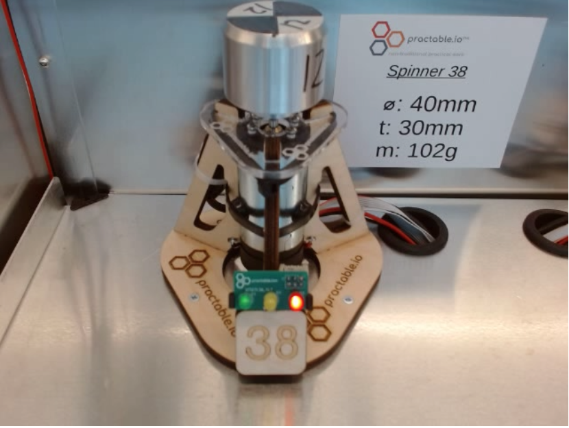
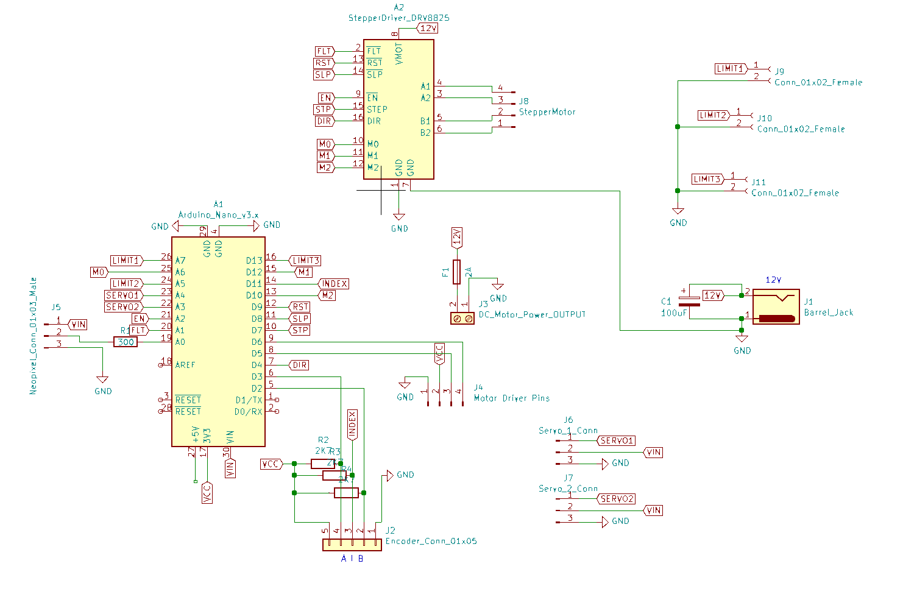

# spinner-amax-firmware
Arduino Nano 33 IOT Firmware for the [amax-spinner](https://github.com/practable/spinner-amax) hardware

## About

This firmware is intended to work with the [amax-spinner](https://github.com/practable/spinner-amax) hardware as shown in Fig. 1.

<figure>

<figcaption align = "center"><b>Fig. 2. Spinner hardware using AMAX motor</b></figcaption>
</figure>

The firmware is configured to use a printed circuit board designed according to the schematic in Fig. 2.
<figure>

<figcaption align = "center"><b>Fig. 2. Spinner circuit schematic</b></figcaption>
</figure>


## History

This firmware was developed in [dpreid/pidcontroller](https://github.com/dpreid/pidcontroller), and covered several different experiments based around a brushed DC motor. One of the experiments (this one) has been significantly upgraded (new motor, encoder) so the firmware has been split off into this repo to avoid confusion. The starting point for this repo is the code that was used to deliver over 2,500 hours of experiments in the early part of 2022.

## Contents

The repo contains several directories, with the code in `SpinningDiskController.`

### ./SpinningDiskController

This is the arduino firmware itself - note that the Arduino convention is to use camel case with an initial capital letter, and that the folder name should match the sketch name.

### ./libraries

These are the libraries required by the firmware 

### ./test

This directory contains tests - see [./test/README.md](./test/README.md) for details.

### ./scripts

This directory contains scripts to compile and upload, and an example ansible task for a raspberry pi running pios.

## Usage

The 'upload.sh' script will compile and upload the firmware, assuming you have a working command-line development environment for the Arduino Nano 33 IOT.

### Installing firmware on raspberry pi via cli

If you have installed the `arduino-cli` but not yet compiled for the Nano IOT 33, then add support for this hardware by 

```
arduino-cli core update-index
arduino-cli core install arduino:samd
```


