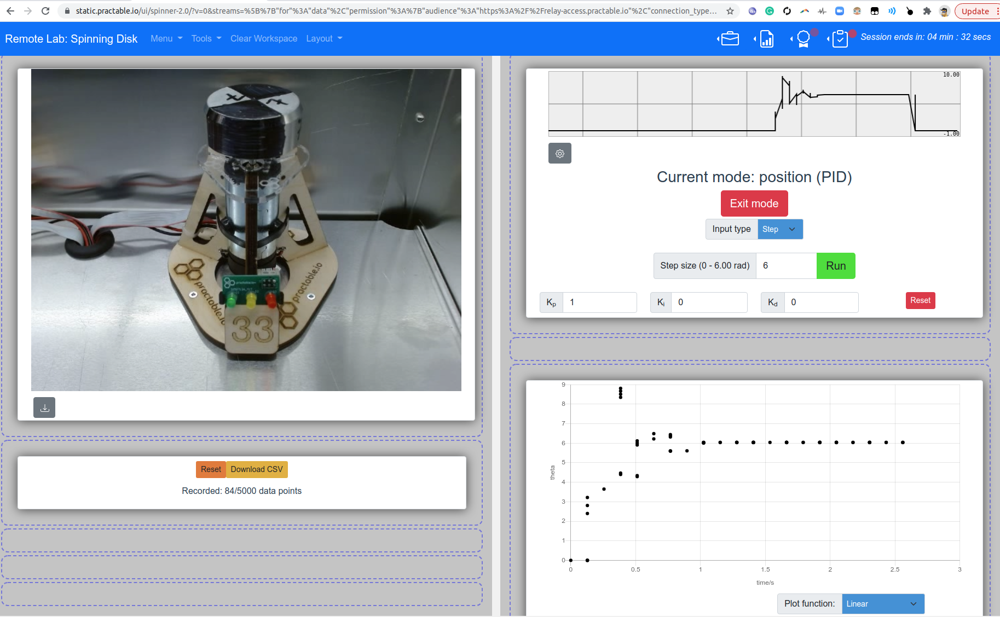
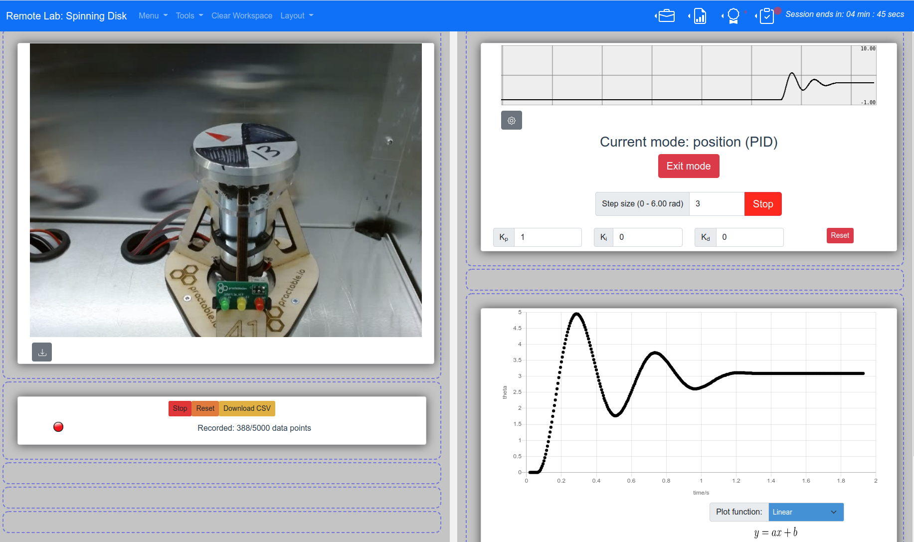
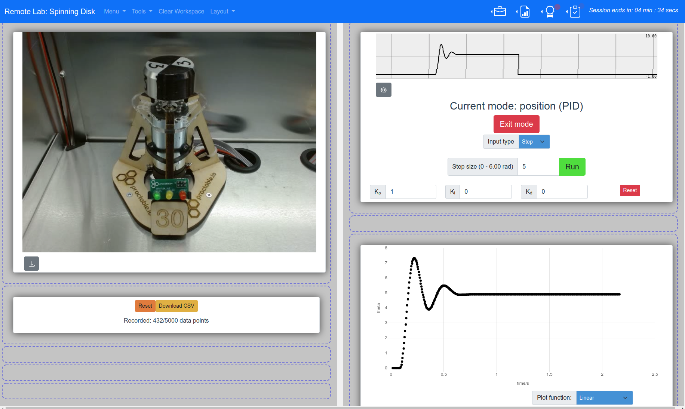

# Tests

This folder contains sub-folder(s) with test(s), as described below:

# Conversion

This test was used to diagnose an [issue with time stamps](https://github.com/dpreid/pidcontroller/issues/4). The commentary on the issue is reproduced here:

### Issue Jan 4 2022 - timdrysdale

#### Issue description

Reported time data is often the same for all values across several messages

#### Steps to reproduce the issue

1. Install SpinningDiskController (63abcf2) on nano IoT 33 with AMAX 32 hardware   & start it running
2. wait for between 1 - 11 days (issue does not show up right away, and occurred sometime in this window)
2. log into host machine and collect raw reports from ```websocat ws://localhost:8888/ws/pendulum -```
3. access machine via UI and run a position control step of 3 radians.

#### What's the expected result?

Smoothly plotted data in the UI and in the graph recorder, i.e. data with time values that increment for each value, by the time step being used by the PI controller.


#### What's the actual result?

The same time value given for between 5-8 messages, before incrementing by 128ms (at least, this was the case for snippet checked).

#### Additional details / screenshot

```
{"d":[0.50,0.77,1.08,1.43],"v":[36.00,47.71,56.51,65.03],"t":[1126560640.00,1126560640.00,1126560640.00,1126560640.00],"y":[4.50,4.23,3.92,3.57],"c":[5.00,5.00,5.00,5.00],"e":[4.50,4.23,3.92,3.57],"p_sig":0,"i_sig":0,"d_sig":0,"m":"p"}
{"d":[1.81,2.21,2.63,3.06],"v":[72.38,77.36,81.53,84.49],"t":[1126560640.00,1126560640.00,1126560640.00,1126560640.00],"y":[3.19,2.79,2.37,1.94],"c":[5.00,5.00,5.00,5.00],"e":[3.19,2.79,2.37,1.94],"p_sig":0,"i_sig":0,"d_sig":0,"m":"p"}
{"d":[3.49,3.91,4.33,4.74],"v":[85.64,85.19,84.58,83.10],"t":[1126560640.00,1126560640.00,1126560640.00,1126560640.00],"y":[1.51,1.09,0.67,0.26],"c":[5.00,5.00,5.00,5.00],"e":[1.51,1.09,0.67,0.26],"p_sig":0,"i_sig":0,"d_sig":0,"m":"p"}
{"d":[5.12,5.50,5.83,6.14],"v":[79.56,76.10,71.23,64.80],"t":[1126560640.00,1126560640.00,1126560640.00,1126560640.00],"y":[-0.12,-0.50,-0.83,-1.14],"c":[5.00,5.00,5.00,5.00],"e":[-0.12,-0.50,-0.83,-1.14],"p_sig":0,"i_sig":0,"d_sig":0,"m":"p"}
{"d":[6.42,6.66,6.85,7.02],"v":[59.64,52.62,44.28,37.51],"t":[1126560640.00,1126560640.00,1126560640.00,1126560640.00],"y":[-1.42,-1.66,-1.85,-2.02],"c":[5.00,5.00,5.00,5.00],"e":[-1.42,-1.66,-1.85,-2.02],"p_sig":0,"i_sig":0,"d_sig":0,"m":"p"}
{"d":[7.15,7.24,7.29,7.31],"v":[30.33,22.54,14.98,7.44],"t":[1126560640.00,1126560640.00,1126560640.00,1126560640.00],"y":[-2.15,-2.24,-2.29,-2.31],"c":[5.00,5.00,5.00,5.00],"e":[-2.15,-2.24,-2.29,-2.31],"p_sig":0,"i_sig":0,"d_sig":0,"m":"p"}
{"d":[7.29,7.25,7.17,7.07],"v":[0.74,-5.30,-11.56,-16.99],"t":[1126560640.00,1126560640.00,1126560768.00,1126560768.00],"y":[-2.29,-2.25,-2.17,-2.07],"c":[5.00,5.00,5.00,5.00],"e":[-2.29,-2.25,-2.17,-2.07],"p_sig":0,"i_sig":0,"d_sig":0,"m":"p"}
{"d":[6.95,6.81,6.65,6.48],"v":[-21.49,-25.62,-29.42,-32.35],"t":[1126560768.00,1126560768.00,1126560768.00,1126560768.00],"y":[-1.95,-1.81,-1.65,-1.48],"c":[5.00,5.00,5.00,5.00],"e":[-1.95,-1.81,-1.65,-1.48],"p_sig":0,"i_sig":0,"d_sig":0,"m":"p"}
{"d":[6.30,6.11,5.92,5.72],"v":[-34.62,-37.11,-38.21,-38.60],"t":[1126560768.00,1126560768.00,1126560768.00,1126560768.00],"y":[-1.30,-1.11,-0.92,-0.72],"c":[5.00,5.00,5.00,5.00],"e":[-1.30,-1.11,-0.92,-0.72],"p_sig":0,"i_sig":0,"d_sig":0,"m":"p"}
{"d":[5.53,5.33,5.15,4.97],"v":[-38.64,-39.21,-38.70,-36.39],"t":[1126560768.00,1126560768.00,1126560768.00,1126560768.00],"y":[-0.53,-0.33,-0.15,0.03],"c":[5.00,5.00,5.00,5.00],"e":[-0.53,-0.33,-0.15,0.03],"p_sig":0,"i_sig":0,"d_sig":0,"m":"p"}
{"d":[4.80,4.63,4.49,4.34],"v":[-35.02,-33.76,-31.37,-29.15],"t":[1126560768.00,1126560768.00,1126560768.00,1126560768.00],"y":[0.20,0.37,0.51,0.66],"c":[5.00,5.00,5.00,5.00],"e":[0.20,0.37,0.51,0.66],"p_sig":0,"i_sig":0,"d_sig":0,"m":"p"}
{"d":[4.23,4.12,4.03,3.96],"v":[-26.38,-23.28,-20.14,-16.43],"t":[1126560768.00,1126560768.00,1126560768.00,1126560768.00],"y":[0.77,0.88,0.97,1.04],"c":[5.00,5.00,5.00,5.00],"e":[0.77,0.88,0.97,1.04],"p_sig":0,"i_sig":0,"d_sig":0,"m":"p"}
{"d":[3.90,3.86,3.84,3.84],"v":[-13.52,-9.83,-5.79,-2.28],"t":[1126560768.00,1126560768.00,1126560768.00,1126560768.00],"y":[1.10,1.14,1.16,1.16],"c":[5.00,5.00,5.00,5.00],"e":[1.10,1.14,1.16,1.16],"p_sig":0,"i_sig":0,"d_sig":0,"m":"p"}
```



### Comment Jan 4 2022 - timdrysdale

Some testing of casts between float and unsigned longs indicates this issue could show up as soon as 2^24 milliseconds, or <5 hours for a 1ms time step in the PID loop.  For a 4ms time step, the expected run time before encountering the issue is 
2^26 ms = 67108864 ms, which is 18.6 hours. The default time step is 5ms, so onset of the issue should occur after this time, but before 2^27 ms (~37hours).

The likely fix is to store the times as unsigned longs, rather than converting them to floats for storage before communicating over serial link. Any other internal usage of millis after conversion to floats should also be checked - but I would hope there is only a time step used in the PID library, not the actual current time in millis so this should not affect the working of the controller itself.
```
TEST(Conversion, JustUnderTwoPower24Millis) {

  unsigned long i = 	16777210;  
  float t0 = (float) i;
  float t1 = (float) i+1;
  EXPECT_TRUE(t1 > t0);
  
}


TEST(Conversion, TwoPower24Millis) {

  unsigned long i = 	16777216;  
  float t0 = (float) i;
  float t1 = (float) i+1;
  EXPECT_TRUE(t1 > t0);
  
}
```
```
     Start  6: Conversion.JustUnderTwoPower24Millis
 6/12 Test  #6: Conversion.JustUnderTwoPower24Millis ...   Passed    0.01 sec
      Start  7: Conversion.TwoPower24Millis
 7/12 Test  #7: Conversion.TwoPower24Millis ............***Failed    0.01 sec

```

Since the time step in the PID loop is 4ms, then it takes 4x as long before the problem first occurs:
```
TEST(Conversion, JustUnderTwoPower26MillisDelta4) {

  unsigned long i = 67108859;	
  float t0 = (float) i;
  float t1 = (float) i+4;
  EXPECT_TRUE(t1 > t0);
  
}

TEST(Conversion, TwoPower26MillisDelta4) {

  unsigned long i = 67108864;	
  float t0 = (float) i;
  float t1 = (float) i+4;
  EXPECT_TRUE(t1 > t0);
  
}
```
```
      Start  8: Conversion.JustUnderTwoPower26MillisDelta4
 8/15 Test  #8: Conversion.JustUnderTwoPower26MillisDelta4 ...   Passed    0.01 sec
      Start  9: Conversion.TwoPower26MillisDelta4
 9/15 Test  #9: Conversion.TwoPower26MillisDelta4 ............***Failed    0.01 sec

```

### Comment Jan 5 2022 - timdrysdale


Update on Spin41 with the fix: it is still giving good time stamp data 16hours after restart. Since the issue occurs with the unpatched code after 10 hours or sooner (in previous comment) we can consider PR https://github.com/dpreid/pidcontroller/pull/5 to be a working and ready for roll out.
```
$pi@raspberrypi:~ $ date -d "$(</proc/uptime awk '{print $1}') seconds ago"
Wed 22 Dec 16:24:10 GMT 2021
$ websocat ws://localhost:8888/ws/pendulum -
<snip>
{"d":[3.09,3.09,3.09,3.09],"v":[0.00,0.00,0.00,0.00],"t":[49780984,49780989,49780994,49780999],"y":[0.00,0.00,0.00,0.00],"c":[0.00,0.00,0.00,0.00],"e":[0.00,0.00,0.00,0.00],"p_sig":0,"i_sig":0,"d_sig":0,"m":"s"}
{"d":[3.09,3.09,3.09,3.09],"v":[0.00,0.00,0.00,0.00],"t":[49781004,49781009,49781014,49781019],"y":[0.00,0.00,0.00,0.00],"c":[0.00,0.00,0.00,0.00],"e":[0.00,0.00,0.00,0.00],"p_sig":0,"i_sig":0,"d_sig":0,"m":"s"}

{"d":[3.09,3.09,3.09,3.09],"v":[0.00,0.00,0.00,0.00],"t":[49781024,49781029,49781034,49781039],"y":[0.00,0.00,0.00,0.00],"c":[0.00,0.00,0.00,0.00],"e":[0.00,0.00,0.00,0.00],"p_sig":0,"i_sig":0,"d_sig":0,"m":"s"}
{"d":[3.09,3.09,3.09,3.09],"v":[0.00,0.00,0.00,0.00],"t":[49781044,49781049,49781054,49781059],"y":[0.00,0.00,0.00,0.00],"c":[0.00,0.00,0.00,0.00],"e":[0.00,0.00,0.00,0.00],"p_sig":0,"i_sig":0,"d_sig":0,"m":"s"}
{"d":[3.09,3.09,3.09,3.09],"v":[0.00,0.00,0.00,0.00],"t":[49781064,49781069,49781074,49781079],"y":[0.00,0.00,0.00,0.00],"c":[0.00,0.00,0.00,0.00],"e":[0.00,0.00,0.00,0.00],"p_sig":0,"i_sig":0,"d_sig":0,"m":"s"}
<snip>
```
##### screenshot of data


##### Spin30  
For comparison, spin30 with original firmware after 18hours running, visibly showing issue in UI (note variation in slope of the plotted lines, i.e. small vertical jumps between some data points)


